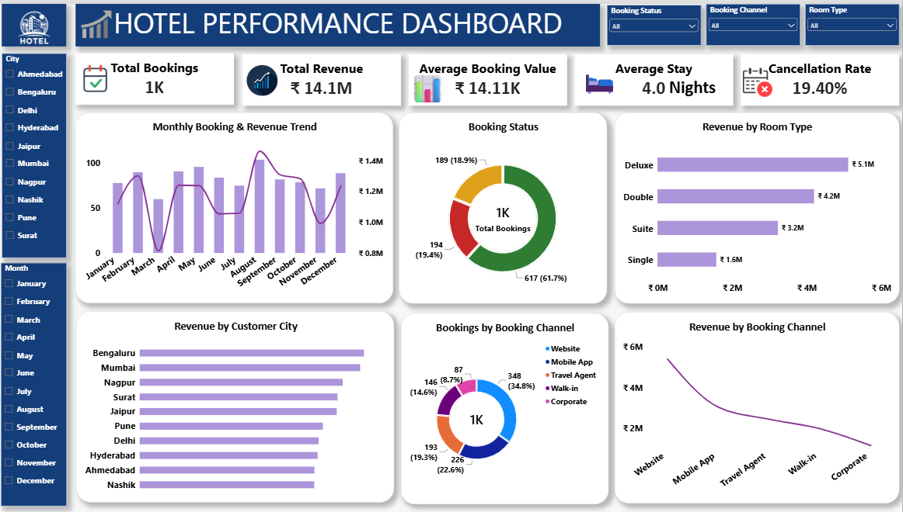

# 🏨 Hotel Performance Dashboard

## 📊 Project Overview

The Hotel Performance Dashboard is a Data Analytics project developed using Power BI and SQL.

The objective of this project is to analyze hotel booking data and provide useful insights into revenue, bookings, room performance, customer locations, booking channels, and cancellations.

The dashboard helps management understand hotel performance and identify areas that may require improvement.

---

## 🎯 Business Problem

A hotel has a large amount of booking data, but management does not have a clear view of its revenue, 
customer booking patterns, room performance, booking channels, and cancellations. :

- Overall booking performance
- Revenue generated
- Customer booking patterns
- Room type performance
- Booking channel performance
- Customer city contribution
- Booking cancellations
- Monthly booking and revenue trends

A centralized dashboard is required to convert the raw booking data into meaningful business insights.

---

## 🎯 Business Objectives

The main objectives are:

1. Analyze total hotel bookings.
2. Measure total revenue.
3. Calculate average booking value.
4. Analyze average customer stay.
5. Measure cancellation rate.
6. Compare revenue by room type.
7. Analyze booking channels.
8. Identify high-revenue customer cities.
9. Analyze monthly booking trends.
10. Support data-driven business decisions.

---

## 🛠️ Tools & Technologies

- Microsoft Excel
- SQL / MySQL
- Power BI
- Power Query
- DAX
- GitHub

---

## 📌 Key KPIs

| KPI | Value |
|---|---:|
| Total Bookings | 1K |
| Total Revenue | ₹14.1M |
| Average Booking Value | ₹14.11K |
| Average Stay | 4.0 Nights |
| Cancellation Rate | 19.40% |

---

## 📈 Dashboard Features

### Booking Analysis

- Total Bookings
- Booking Status
- Monthly Booking Trend
- Booking Channel Analysis

### Revenue Analysis

- Total Revenue
- Revenue by Room Type
- Revenue by Customer City
- Revenue by Booking Channel
- Monthly Revenue Trend

### Customer Analysis

- Customer City
- Booking Channel
- Booking Behavior

### Room Analysis

- Deluxe
- Double
- Suite
- Single

---

## 🔍 Key Insights

- The dashboard records approximately 1K total bookings.
- Total revenue is approximately ₹14.1M.
- The average booking value is approximately ₹14.11K.
- Customers stay for an average of approximately 4 nights.
- The cancellation rate is approximately 19.40%.
- Deluxe rooms contribute the highest revenue among the displayed room types.
- Booking activity varies across different customer cities.
- Website and mobile-based channels contribute substantially to bookings.
- Monthly booking and revenue trends show variation throughout the year.

---

##  SQL Analysis

SQL was used to analyze:

- Total bookings
- Total revenue
- Average booking value
- Average stay
- Cancellation rate
- Revenue by room type
- Revenue by booking channel
- Revenue by city
- Booking status
- Monthly booking performance

SQL queries are available in:

`SQL/Hotel_Performance_Analysis.sql`

---

## 📊 Power BI Dashboard

The Power BI dashboard contains:

- KPI Cards
- Monthly Booking & Revenue Trend
- Booking Status Donut Chart
- Revenue by Room Type
- Revenue by Customer City
- Bookings by Booking Channel
- Revenue by Booking Channel
- Interactive filters

### Dashboard Preview

---
